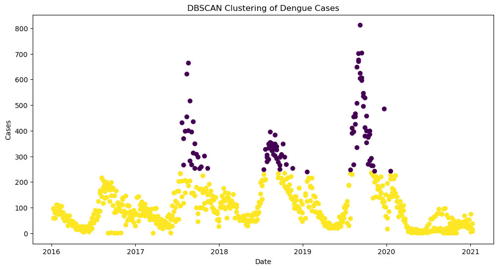
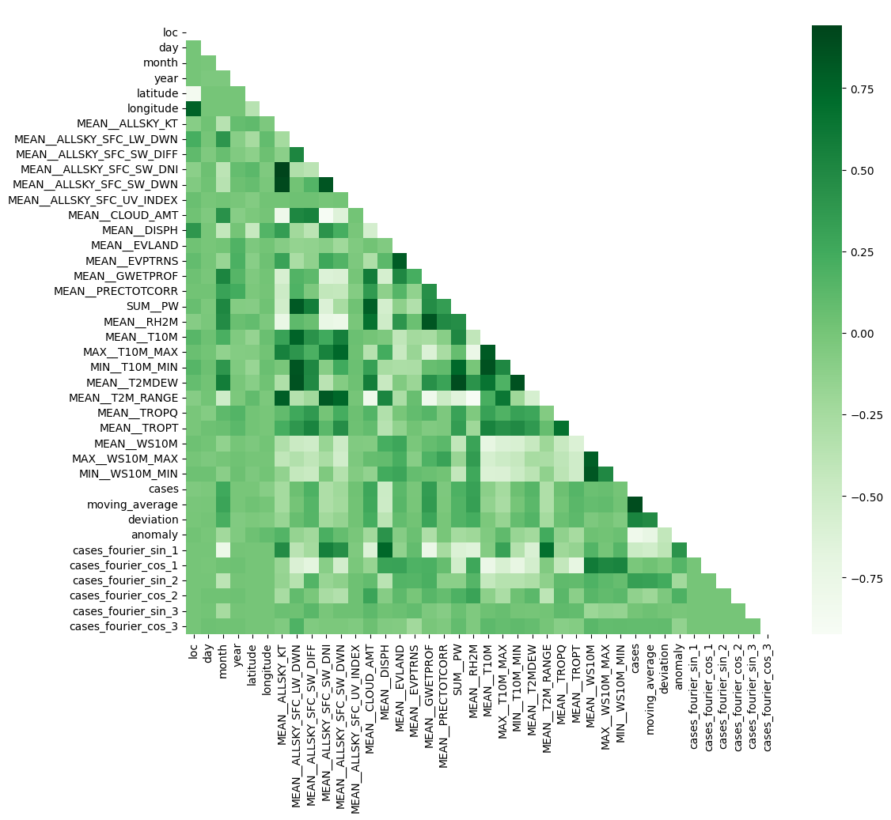
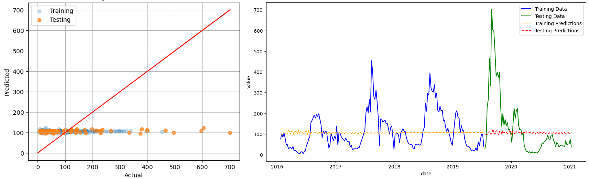
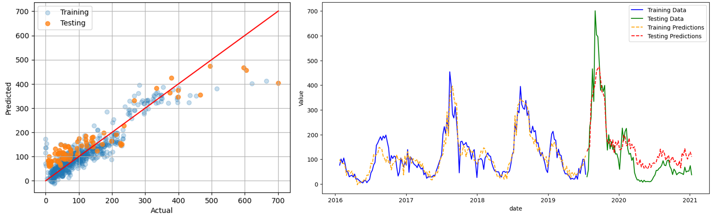
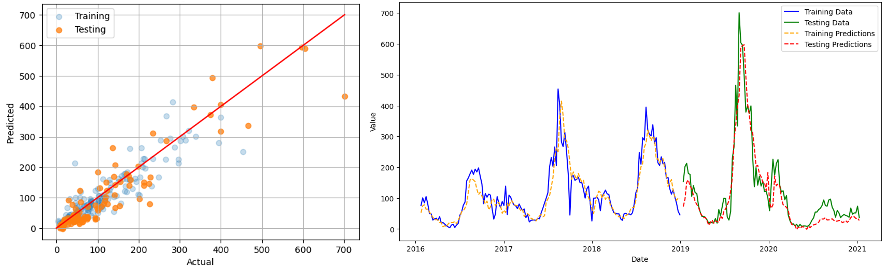
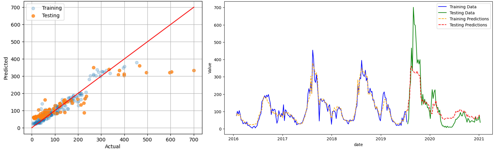
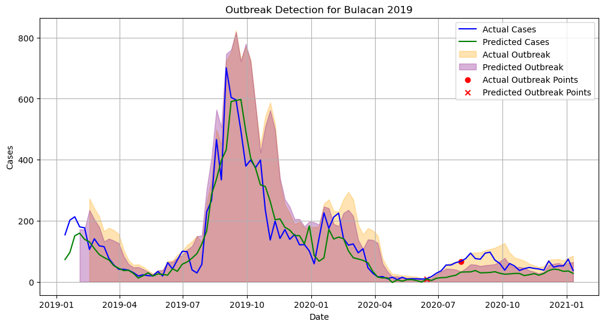
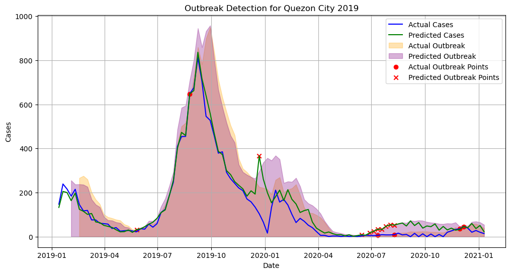
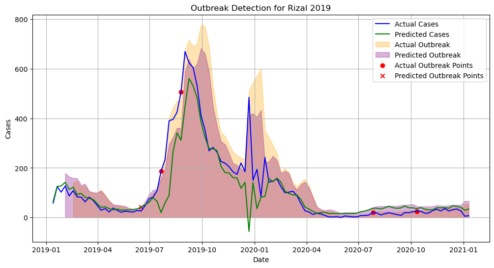

# Climatologically-driven temporal predictive modeling of dengue cases in Philippine locations

## Abstract

Dengue fever is a major public health concern, particularly in countries like the Philippines where dengue incidence is surging and highly variable. To address this, predictive models for dengue cases were developed for Bulacan, Quezon City, and Rizal—Philippine locations within the same dengue case cluster—using statistical and machine learning techniques. The process started with K-means clustering and t-SNE for location grouping, followed by stationarity checks to ensure data stability. The study integrated temporal patterns of dengue incidence, geographical features, outlier features, and selected climatic factors to create predictive features of dengue cases. Univariate correlation checks were then used to reduce dimensionality. For time series forecasting, SARIMA and SARIMAX models tuned by Auto-ARIMA were applied. These statistical models were compared to classical machine learning models obtained through TPOT, with hyperparameters tuned with Optuna. The **Stochastic Gradient Descent (SGD) Regressor** emerged as the best model, achieving a **mean absolute error (MAE) of 32.26, a root mean squared error (RMSE) of 59.32, and an R-squared (R²) value of 83.40%**.  This demonstrated significant predictive accuracy compared to other models. However, the model did not show potential in accurately predicting dengue outbreaks, indicating that more sophisticated features are needed for precise outbreak predictions.

-------

Slide deck is located [here](Deck).
The details of the methodology and results are discussed in the following sections.
- [Dataset Collection](#data-collection)
- [Data Preprocessing](#data-preprocessing)
- [Feature Processing](#feature-processing)
- [Model Survey](#model-survey)
- [Hyperparameter Tuning](#hyperparameter-tuning)
- [Results](#results)
- [Conclusions and Recommendations](#conclusions-and-recommendations)
- [References](#references)

## Data Collection 
The dataset used in this study combines dengue case data and climate variables to create the input features and target for analysis. 
1. Dengue case data, covering weekly confirmed cases and deaths from January 10, 2016, to January 10, 2021, across 126 locations in the Philippines, was sourced from the [Department of Health-Epidemiology Bureau and hosted by the Humanitarian Data Exchange](https://data.humdata.org/dataset/philippine-dengue-cases-and-deaths) labeled as `DOH-Epi Dengue Data 2016-2021`.
2. Climate data was obtained from [NASA’s POWER Project via its API](https://power.larc.nasa.gov/), which provided daily meteorological variables for each location based on their coordinates. The selected climate variables, totaling to 59 features, configured to align with the study's requirements are attached in this [Annex](Assets/AnnexClimateVariables.pdf).

## Data Preprocessing
1. **Temporal Alignment** - To integrate weekly dengue case data with daily climate variables, the climate data was aggregated into weekly values. Aggregation methods, such as weekly sum for precipitation and maximum or minimum for extreme temperatures, were applied based on the nature of each climate feature. Further details are also presented in the Annex for selected climate features.

2. **Data Imputation** - Missing weeks in the dengue case data were filled using forward fill, ensuring data continuity by propagating the last known value.

3. **Location Clustering** - Locations were clustered to account for climatic variations and focus analysis on specific regions. A t-SNE + K-Means clustering pipeline optimized with Optuna achieved 28 clusters, yielding an average silhouette score of 0.42. One cluster, including Bulacan, Quezon City, and Rizal, was selected for further analysis. Details of clustering results and hyperparameters are presented in table and plot below.

    ### Tuned Hyperparameters of t-SNE and K-Means Clustering

    | Algorithm | Hyperparameter              | Range         | Result  |
    |-----------|-----------------------------|---------------|---------|
    | t-SNE     | Number of components        | 2             | 2       |
    |           | Perplexity                  | 5 - 50        | 39.14   |
    |           | Learning rate               | 10 - 1000     | 527.07  |
    | K-means   | Number of clusters          | 20 - 40       | 28      |
    |           | Initialization method (init)| k-means++, random | k-means++ |
    |           | Initialization runs (n_init)| 1 - 30        | 23      |

    ### Plot of Clustered Locations
    

4. **Stationarity Check** - The stationarity of the dataset was confirmed using the Augmented Dickey-Fuller (ADF) test. Both dengue cases and climate variable time series were found to be stationary, as evidenced by low p-values and test statistics below the critical values shown in the table below.

    | Location      | Test Statistics | Critical Value (5%) | p-Value   |
    |---------------|-----------------|---------------------|-----------|
    | Bulacan       | -4.6872         | -2.8729             | 8.89e-5   |
    | Rizal         | -3.9619         | -2.8729             | 0.0016    |
    | Quezon City   | -3.8470         | -2.8730             | 0.0025    |

After preprocessing, the dataset included 33,012 data points, reduced to 783 time series data points for the selected cluster. The clustering results and ADF test outcomes demonstrate the dataset's readiness for modeling.

## Feature Processing

The following describes the steps taken to preprocess and engineer features for predictive analysis of dengue cases.

1.  **Temporal Feature Engineering** - Extracted day, month, and year from the date, added lagged 4-week moving averages, and applied Fourier series transformations to capture the cyclical nature of dengue case patterns over a year.

2. **Geographical Feature Engineering** - Included latitude, longitude, and location labels as encoded features.

3. **Anomaly Detection** - Used [Density-Based Spatial Clustering of Applications with Noise (DBSCAN)](https://scikit-learn.org/stable/modules/generated/sklearn.cluster.DBSCAN) with parameters (`eps`, `min_samples`) optimized via grid search to detect data anomalies and consider them as features. 

    

    A **silhouette score of 0.72, identifying 14% of the dengue cases as outliers**, primarily composed of points belonging to weeks with increasing spikes as seen on the scatter plot below was obtained.

4. **Univariate Correlation Check** - Performed Pearson univariate correlation analysis to address multicollinearity and reduce redundancy of normalized features. A **threshold of 0.95 was set for the absolute values of the correlation coefficients**, where feature pairs with a correlation above this threshold were deemed highly correlated. This process of removing highly correlated features helps avoid redundancy and overfitting and improves model interpretability

    

    After perform the feature selection, **19 climate features were successfully filtered out resulting to the 40 features** as shown in the correlation plot above.

## Model Survey

### Statistical Time Series Models

For time series forecasting, **ARIMA** (Autoregressive Integrated Moving Average) was best known statistical model to use. However, given the seasonality in the data, the extended version **SARIMA** (Seasonal ARIMA) which includes seasonal components was utilized in this porject. Furthermore, **SARIMAX** which incorporating exogenous variables (external factors), was also considered to account for multivariate time series. 

---

### Classical Machine Learning Models

For classical machine learning models, the [TPOT (Tree-based Pipeline Optimization Tool)](http://epistasislab.github.io/tpot/) tool was used to automate and select the best-performing model. TPOT applies genetic programming to explore various machine learning pipelines and identify the optimal model. The models evaluated included several regression methods to predict dengue cases, with the following models emerging as top two best models:

- **SGD Regressor**: Best performance with a TPOT score of -3340.9179, utilizing Huber loss and ElasticNet regularization, making it robust to outliers.
- **XGBoost Regressor**: Known for handling complex relationships with a TPOT score of -3732.0512.

## Hyperparameter Tuning

### Auto-ARIMA
For tuning the parameters of the **SARIMA** and **SARIMAX** models, the [`auto-arima`](https://alkaline-ml.com/pmdarima/modules/generated/pmdarima.arima.auto_arima.html) function was used. It optimizes the order of parameters by minimizing the **Akaike Information Criterion (AIC)** through a grid search over predefined ranges for the values of `p`, `d`, `q`, `P`, `D`, and `Q`. The hyperparameter ranges and tuned values for **SARIMA** and **SARIMAX** are listed below:

| Hyperparameter | Range        | SARIMA | SARIMAX |
|-----------------|--------------|--------------|--------------|
| p               | 0 to 5       | 2 | 1 |
| d               | 0 to 2       | 1 | 0 |
| q               | 0 to 5       | 3 | 1 |
| P               | 0 to 5       | 3 | 0 |
| D               | 0 to 2       | 0 | 0 |
| Q               | 0 to 5       | 2 | 0 |
| m               | 0 to 5       | 4 | 4 |

---

### Optuna
For tuning hyperparameters of the classical ML models, **SGD Regressor** and **XGBoost Regressor**, [Optuna](https://optuna.org) was employed. Optuna is an open-source optimization tool that surpasses traditional search methods by using sophisticated algorithms like **Tree-structured Parzen Estimator (TPE)**. This optimization process iteratively refines the hyperparameter range to minimize the selected metric, RMSE. The hyperparameter ranges together with their result for **SGD** and **XGBoost** are as follows:

| Algorithm       | Hyperparameter    | Range               | Tuned Values |
|-----------------|-------------------|---------------------|---------------------|
| **XGBoost**     | n estimators      | 50 to 200           | 164 |
|                 | max depth         | 2 to 32 (log scale) | 4 |
|                 | learning rate     | 0.01 to 0.1 (log scale) |  0.0283 |
|                 | subsample         | 0.1 to 0.7          | 0.452 |
|                 | min child weight  | 8 to 400            | 14 |
| **SGD Regressor** | alpha            | 1e-6 to 1e-1        | 0.0304 | 
|                 | fit intercept     | True, False         | True |
|                 | l1 ratio          | 0.0 to 1.0         | 0.8563 |
|                 | learning rate     | constant, optimal, invscaling, adaptive | invscaling |
|                 | loss              | epsilon insensitive, huber, squared error, squared epsilon insensitive | huber |
|                 | penalty           | l2, l1, elasticnet | elasticnet |
|                 | power t           | 0.1 to 1.0         |  0.2232 |

## Results
### Model Evaluation
The final performance metrics for the tuned models used in predicting dengue fever incidence across Bulacan, Quezon City, and Rizal are summarized in following plots and tables.

| Model             | Result                  |
|-------------------|-------------------------|
| SARIMA            |  |
| SARIMAX           |  |
| SGD Regressor     |  |
| XGBoost           |  |

From the plots, it is evident that SGDRegressor and SARIMAX effectively predicted potential spikes in dengue cases, with SGDRegressor showing a more pronounced prediction. In contrast, XGBoost overfitted the data, failing to accurately predict sudden increases in the target variable, which indicates its poor generalization ability.

The results are also supported by the table below which summarizes the final performance metrics (MAE, RMSE, and $R^2$) for the tuned models.

| Model          | MAE    | RMSE   | R-squared |
|----------------|--------|--------|-----------|
| SARIMA         | 130.87 | 175.85 | -5.14%    |
| SARIMAX        | 77.37  | 89.36  | 73.14%    |
| XGBoost        | 58.48  | 91.08  | 71.93%    |
| SGDRegressor   | 32.26  | 59.32  | 83.40%    |

The table highlights that **SGDRegressor achieved the best performance** with the lowest MAE (32.26), RMSE (59.32), and the highest R-squared (83.40%), indicating it most accurately predicted dengue incidence. SARIMAX followed closely with an MAE of 77.37 and an R-squared of 73.14%, benefiting from the inclusion of exogenous variables. XGBoost demonstrated solid performance with an R-squared of 71.93%, while SARIMA performed the worst, with a negative R-squared value of -5.14%, suggesting it was less effective in capturing the data's underlying patterns. Overall, the models incorporating external variables or handling complex relationships performed better than SARIMA.

----- 

### Outbreak Prediction
For a use-case of this project, the latest [WHO technical handbook for dengue surveillace](https://www.who.int/publications/i/item/9789241549738) was used to identify weeks as outbreak. 

The `moving average` method was applied to predict dengue outbreaks. This method is suitable for diseases with moderate to high prevalence and seasonal fluctuations. The threshold is calculated as the sum of the 3-period moving average of 4-week dengue case periods, plus 2 standard deviations of cases from the 4 weeks prior. This method was used to predict outbreaks for the year **2019-2020 in Bulacan, Rizal, and Quezon City**, based on weekly predicted dengue cases.

| Location | Outbreak Prediction                          |
|----------|----------------------------------------------|
| Bulacan  |  |
| Quezon City |  |
| Rizal    |  |

Based on the graph, the following insights were obtained:
- For Bulacan, the model predicted an outbreak before July, while it actually occurred later. 
- In Rizal, 10 predicted outbreaks occurred, but only 5 were true outbreaks. One outbreak was predicted for January 2020, though it happened in the last quarter of 2019. Additionally, no outbreaks were predicted for the end of 2020. 
- In Quezon City, only one predicted outbreak before July 2019 matched the actual occurrence, and the model missed all 2020 outbreaks.

These discrepancies highlight the sensitivity of the outbreak threshold and the need for more accurate features to distinguish between outbreaks and case spikes.

## Conclusions and Recommendations

This study successfully developed predictive models for dengue cases in Bulacan, Quezon City, and Rizal, integrating climate data and historical dengue incidence. **The Stochastic Gradient Descent (SGD) Regressor emerged as the top-performing model, achieving high accuracy with an MAE of 32.26, RMSE of 59.32, and an $R^2$ of 83.40%**.

However, the models faced challenges in accurately predicting outbreaks, suggesting that more sophisticated features and methods are needed for outbreak prediction. To enhance accuracy, incorporating additional factors such as population, demographics, healthcare access, and city indices should be considered. Moreover, focusing on outbreak classification—predicting whether a location will experience an outbreak—could provide valuable insights.

For improved forecasting, exploring different experimental setups that account for spatial dependencies is recommended. Training models on specific locations using data from neighboring areas or clusters might help capture spatial relationships. Including coordinates of all available locations could further enhance model performance.

Lastly, while not included in this study, using advanced deep learning techniques like Long Short-Term Memory (LSTM) networks with attention mechanisms or Gated Recurrent Units (GRUs) could lead to more robust models capable of handling the complexities of dengue case forecasting.

## References

- Philippine Dengue Cases and Deaths - Humanitarian Data Exchange. [Link](https://data.humdata.org/dataset/philippine-dengue-cases-and-deaths) - Accessed: 12-06-2024.
- N. A. M. H. Abdullah, N. C. Dom, S. A. Salleh, H. Salim, and N. Precha. "The association between dengue case and climate: A systematic review and meta-analysis." *One Health*, 15:100452, 2022.
- J. C. Addawe, J. D. Caro, and R. A. B. Juayong. "Machine learning methods for modeling dengue incidence in local communities." In *Novel & Intelligent Digital Systems Conferences*, pages 392–400. Springer, 2022.
- G. E. Box, G. M. Jenkins, G. C. Reinsel, and G. M. Ljung. *Time series analysis: forecasting and control.* John Wiley & Sons, 2015.
- D. E. Buebos-Esteve and N. H. A. Dagamac. "Spatiotemporal models of dengue epidemiology in the Philippines: Integrating remote sensing and interpretable machine learning." *Acta Tropica*, 255:107225, 2024.
- T. M. Carvajal, K. M. Viacrusis, L. F. T. Hernandez, H. T. Ho, D. M. Amalin, and K. Watanabe. "Machine learning methods reveal the temporal pattern of dengue incidence using meteorological factors in metropolitan Manila, Philippines." *BMC Infectious Diseases*, 18:1–15, 2018.
- P. Farrington and N. Andrews. "Outbreak Detection: Application to Infectious Disease Surveillance." In *Monitoring the Health of Populations: Statistical Principles and Methods for Public Health Surveillance*. Oxford University Press, 12 2003.
- M. O. Faruk, S. Jannat, and M. S. Rahman. "Impact of environmental factors on the spread of dengue fever in Sri Lanka." *International Journal of Environmental Science and Technology*, 19:10637–10648, 2022.
- M. E. Francisco, T. M. Carvajal, M. Ryo, K. Nukazawa, D. M. Amalin, and K. Watanabe. "Dengue disease dynamics are modulated by the combined influences of precipitation and landscape: A machine learning approach." *Science of The Total Environment*, 792:148406, 2021.
- HDT. "Philippines seeing more dengue cases in 2024," May 2024. Accessed: 2024-06-17.
- Q. Jing and M. Wang. "Dengue epidemiology." *Global Health Journal*, 3(2):37–45, 2019.
- H. Larson, K. Hartigan-Go, and A. de Figueiredo. "Vaccine confidence plummets in the Philippines following dengue vaccine scare: why it matters to pandemic preparedness." *Human Vaccines & Immunotherapeutics*, 15(3):625–627, 2019. [published correction appears in Hum Vaccin Immunother. 2020 Oct 2;16(10):2577. doi: 10.1080/21645515.2019.1628510].
- T. T. Le, W. Fu, and J. H. Moore. "Scaling tree-based automated machine learning to biomedical big data with a feature set selector." *Bioinformatics*, 36(1):250–256, 2020.
- X. Y. Leung, R. M. Islam, M. A. Adhami, D. Ilić, L. McDonald, S. Palawaththa, B. Diug, S. U. Munshi, and M. N. Karim. "A systematic review of dengue outbreak prediction models: Current scenario and future directions." *PLOS Neglected Tropical Diseases*, 17, 2022.
- A. P. Mendoza. "Dengue incidence forecasting model in Magalang, Pampanga using time series analysis." *Informatics in Medicine Unlocked*, 44:101439, 2024.
- R. Mushtaq. "Augmented Dickey Fuller test." 2011.
- C. R. Nurul Azam Mohd Salim, Yap Bee Wah et al. "Prediction of dengue outbreak in Selangor Malaysia using machine learning techniques." *Scientific Reports*, 11:939, 2021.
- T. Phanitchat, B. Zhao, U. Haque, C. Pientong, T. Ekalaksananan, S. Aromseree, K. Thaewnongiew, B. Fustec, M. J. Bangs, N. Alexander, and H. J. Overgaard. "Spatial and temporal patterns of dengue incidence in northeastern Thailand 2006–2016." *BMC Infectious Diseases*, 19, 2019.
- J. G. Rigau-Pérez, P. S. Millard, D. R. Walker, C. C. Deseda, and A. Casta-Vélez. "A deviation bar chart for detecting dengue outbreaks in Puerto Rico." *American Journal of Public Health*, 89(3):374–378, 1999.
- S. Runge-Ranzinger, A. Kroeger, P. Olliaro, L. Bowman, O. Horstick, L. Lloyd, and P. McCall. "Technical handbook for dengue surveillance, dengue outbreak prediction/detection and outbreak response ('model contingency plan')." 10 2016.
- M. Saputra and H. Oktaviannoor. "One health approach to dengue hemorrhagic fever control in Indonesia: A systematic review." *KnE Life Sciences*, 4:201–221, 2018.
- H. P. V. Satya Ganesh Kakarla, Phani Krishna Kondeti et al. "Weather integrated multiple machine learning models for prediction of dengue prevalence in India." *International Journal of Biometeorology*, 67:285–297, 2023.
- D. S. Shepard, E. A. Undurraga, Y. A. Halasa, and J. D. Stanaway. "The global economic burden of dengue: a systematic analysis." *The Lancet Infectious Diseases*, 16(8):935–941, 2016. PMID: 27091092.
- S. Singh, L. C. Herng, L. H. Sulaiman, S. F. Wong, J. Jelip, N. Mokhtar, Q. K. Harpham, G. Tsarouchi, and B. S. Gill. "The effects of meteorological factors on dengue cases in Malaysia." *International Journal of Environmental Research and Public Health*, 19, 2022.
- N. Srisawat, D. Gubler, T. Pangestu, U. Limothai, U. Thisyakorn, Z. Ismail, et al. "Proceedings of the 6th Asia Dengue Summit, June 2023." *PLoS Neglected Tropical Diseases*, 18(3):e0012060, 2024.
- N. Tian, J.-X. Zheng, L.-H. Li, J.-B. Xue, S. Xia, S. Lv, and X.-N. Zhou. "Precision prediction for dengue fever in Singapore: A machine learning approach incorporating meteorological data." *Tropical Medicine and Infectious Disease*, 9(4):72, 2024.
- S. I. Vagropoulos, G. I. Chouliaras, E. G. Kardakos, C. K. Simoglou, and A. G. Bakirtzis. "Comparison of SARIMAX, SARIMA, modified SARIMA and ANN-based models for short-term PV generation forecasting." In *2016 IEEE International Energy Conference (ENERGY-CON)*, pages 1–6, 2016.
- V. N. Valencia, Y. Díaz, J. M. Pascale, M. F. Boni, and J. E. Sánchez-Galán. "Assessing the effect of climate variables on the incidence of dengue cases in the metropolitan region of Panama City." *International Journal of Environmental Research and Public Health*, 18, 2021.
- World Health Organization. *Dengue: Guidelines for Diagnosis, Treatment, Prevention, and Control*, 2009. [Link](https://www.who.int/publications/i/item/9789241547871).
- World Health Organization. "Disease outbreak news: Dengue - global situation, May 2024." Accessed: 12 June 2024.
- V. G. Yu, G. Lasco, and C. C. David. "Fear, mistrust, and vaccine hesitancy: Narratives of the dengue vaccine controversy in the Philippines." *Vaccine*, 39(35):4964–4972, 2021.
