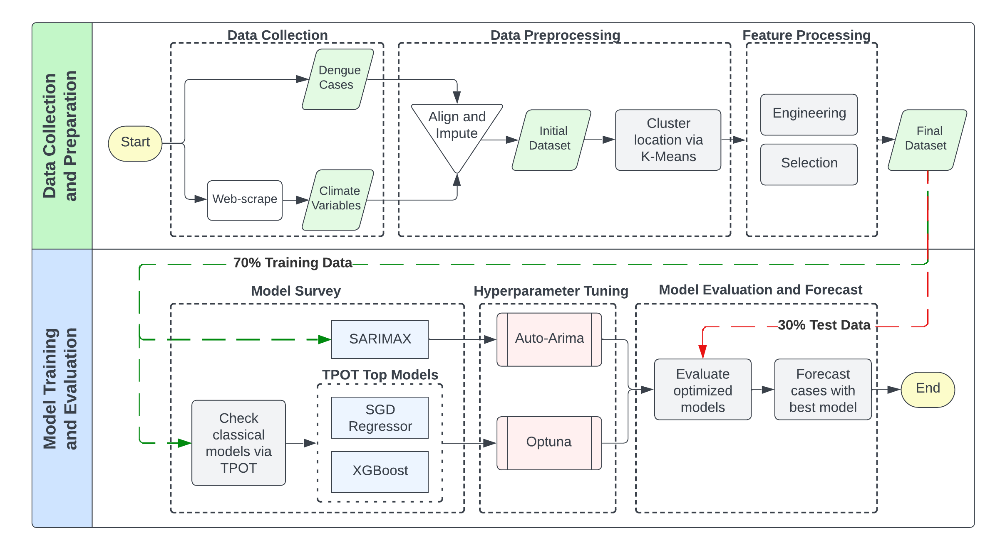
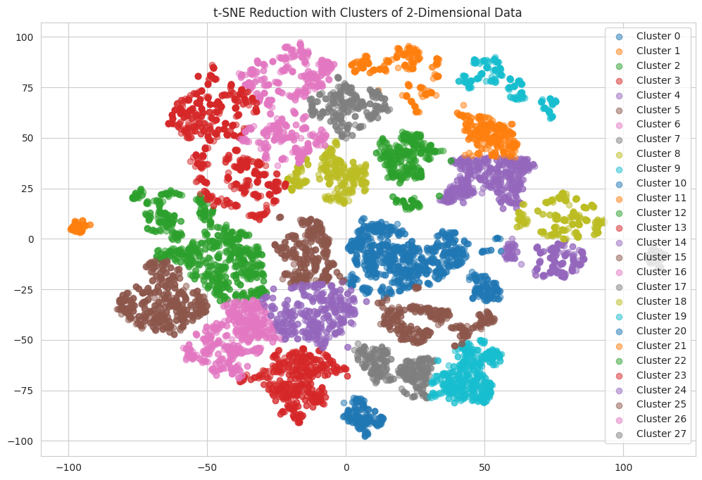

# Climatologically-driven temporal predictive modeling of dengue cases in Philippine locations

## Abstract

Dengue fever is a major public health concern, particularly in countries like the Philippines where dengue incidence is surging and highly variable. To address this, predictive models for dengue cases were developed for Bulacan, Quezon City, and Rizal—Philippine locations within the same dengue case cluster—using statistical and machine learning techniques. The process started with K-means clustering and t-SNE for location grouping, followed by stationarity checks to ensure data stability. The study integrated temporal patterns of dengue incidence, geographical features, outlier features, and selected climatic factors to create predictive features of dengue cases. Univariate correlation checks were then used to reduce dimensionality. For time series forecasting, SARIMA and SARIMAX models tuned by Auto-ARIMA were applied. These statistical models were compared to classical machine learning models obtained through TPOT, with hyperparameters tuned with Optuna. The **Stochastic Gradient Descent (SGD) Regressor** emerged as the best model, achieving a **mean absolute error (MAE) of 32.26, a root mean squared error (RMSE) of 59.32, and an R-squared (R²) value of 83.40%**.  This demonstrated significant predictive accuracy compared to other models. However, the model did not show potential in accurately predicting dengue outbreaks, indicating that more sophisticated features are needed for precise outbreak predictions.

-------

The details of the methodology and results are discussed in the following sections.
- [Dataset Collection](#data-collection)
- [Data Preprocessing](#data-preprocessing)
- [Feature Processing](#feature-processing)
- [Model Survey](#model-survey)
- [Hyperparameter Tuning](#results-and-discussion)
- [Model Evaluation and Forecast](#model-evaluation-and-forecast)
- [Conclusion and Recommendation](#conclusion-and-recommendation)
- [References](#references)

`--update in progress`
## Data Collection 
The dataset used in this study combines dengue case data and climate variables to create the input features and target for analysis. 
1. Dengue case data, covering weekly confirmed cases and deaths from January 10, 2016, to January 10, 2021, across 126 locations in the Philippines, was sourced from the [Department of Health-Epidemiology Bureau and hosted by the Humanitarian Data Exchange](https://data.humdata.org/dataset/philippine-dengue-cases-and-deaths) labeled as `DOH-Epi Dengue Data 2016-2021`.
2. Climate data was obtained from [NASA’s POWER Project via its API](https://power.larc.nasa.gov/), which provided daily meteorological variables for each location based on their coordinates. The selected climate variables, totaling to 54 features, configured to align with the study's requirements are attached in this [Annex](Assets/AnnexClimateVariables.pdf).

## Data Preprocessing
1. **Temporal Alignment** - To integrate weekly dengue case data with daily climate variables, the climate data was aggregated into weekly values. Aggregation methods, such as weekly sum for precipitation and maximum or minimum for extreme temperatures, were applied based on the nature of each climate feature. Further details are also presented in the Annex for selected climate features.

2. **Data Imputation** - Missing weeks in the dengue case data were filled using forward fill, ensuring data continuity by propagating the last known value.

3. **Location Clustering** - Locations were clustered to account for climatic variations and focus analysis on specific regions. A t-SNE + K-Means clustering pipeline optimized with Optuna achieved 28 clusters, yielding an average silhouette score of 0.42. One cluster, including Bulacan, Quezon City, and Rizal, was selected for further analysis. Details of clustering results and hyperparameters are presented in table and plot below.

### Tuned Hyperparameters of t-SNE and K-Means Clustering

| Algorithm | Hyperparameter              | Range         | Result  |
|-----------|-----------------------------|---------------|---------|
| t-SNE     | Number of components        | 2             | 2       |
|           | Perplexity                  | 5 - 50        | 39.14   |
|           | Learning rate               | 10 - 1000     | 527.07  |
| K-means   | Number of clusters          | 20 - 40       | 28      |
|           | Initialization method (init)| k-means++, random | k-means++ |
|           | Initialization runs (n_init)| 1 - 30        | 23      |

### Plot of Clustered Locations

4. **Stationarity Check** - The stationarity of the dataset was confirmed using the Augmented Dickey-Fuller (ADF) test. Both dengue cases and climate variable time series were found to be stationary, as evidenced by low p-values and test statistics below the critical values shown in the table below.

| Location      | Test Statistics | Critical Value (5%) | p-Value   |
|---------------|-----------------|---------------------|-----------|
| Bulacan       | -4.6872         | -2.8729             | 8.89e-5   |
| Rizal         | -3.9619         | -2.8729             | 0.0016    |
| Quezon City   | -3.8470         | -2.8730             | 0.0025    |

After preprocessing, the dataset included 33,012 data points, reduced to 783 time series data points for the selected cluster. The clustering results and ADF test outcomes demonstrate the dataset's readiness for modeling.

## Feature Processing

## Model Survey

## Hyperparameter Tuning

## Model Evaluation and Forecast

## Conclusion and Recommendation

## References

